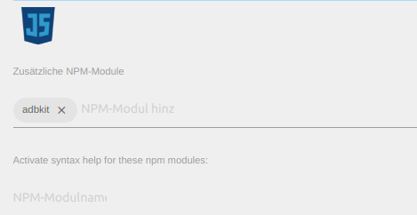
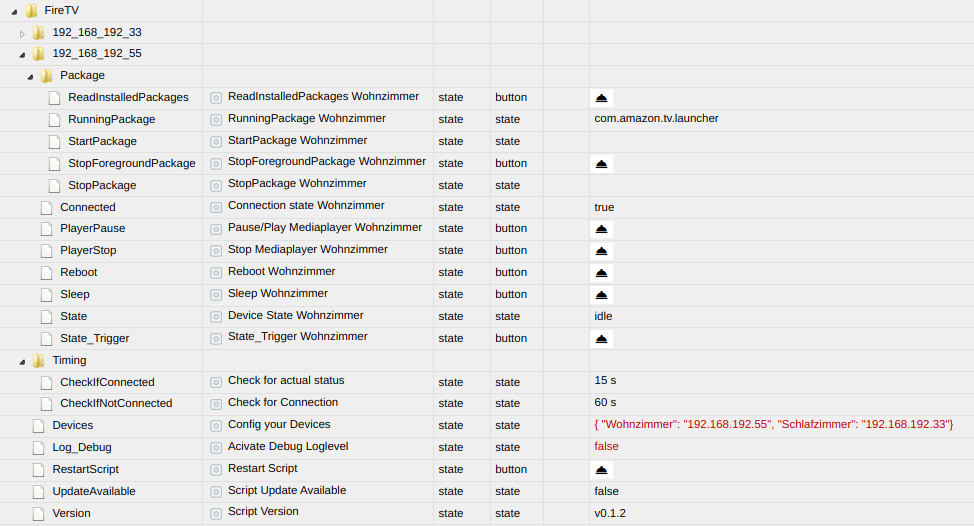
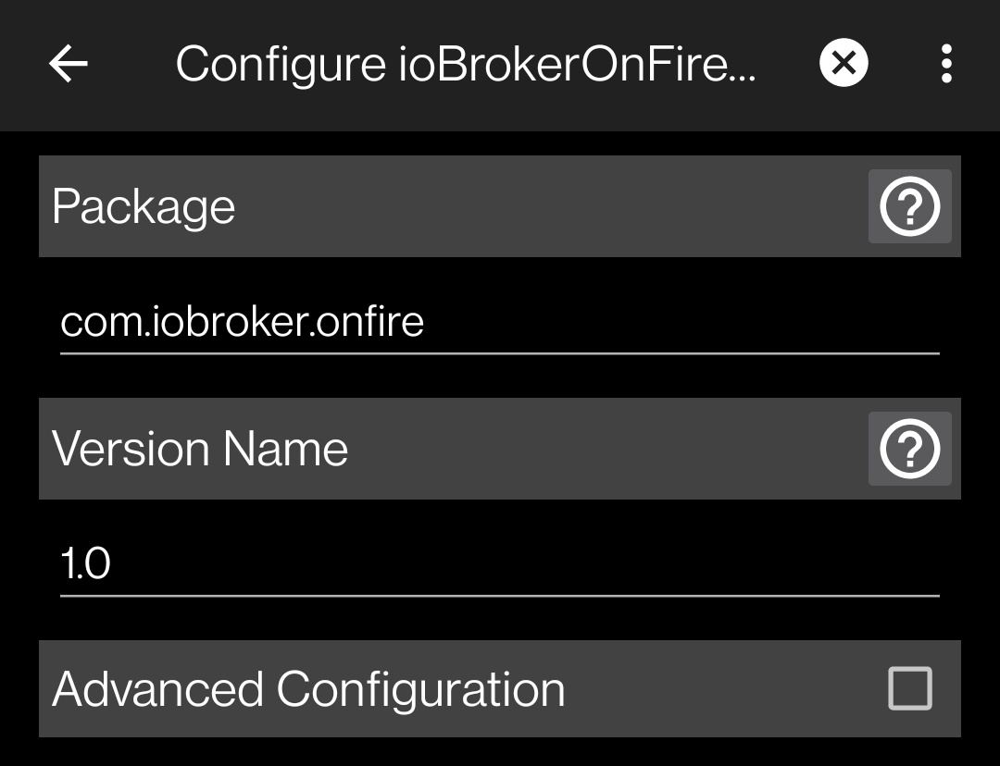

# FireTV Skript für ioBroker

Script zur Steuerung von FireTV Sticks

**Dies ist kein Adapter sondern ein JS-Skript. Es muss aus der Datei /Skripte/skript.js kopiert und in ein neuen JS-Skript einer beliebigen Javascript-Instanz kopiert werden**

* [Start](#start)
* [Erläuterungen](#erläuterungen)
* [Optimierung](#optimierung)
* [ToDos](#todos)
* [Changelog](#changelog)

## Start

Am FireTV Stick muss das ADB-Debugging aktiviert werden unter:

"Mein Fire TV" > "Entwickleroptionen" > "ADB-Debugging"

Die nachfolgenden Schritte erfolgen am ioBroker:

* `adbkit` als Modul in Javascript-Instanz eingeben
  

* Datei `adb` aus Pfad ./ADB lokal auf ioBroker-Host ablegen

* In ioBroker ein neues Javascript unter dem Reiter "Skripte" erstellen und aus diesem Repo den Inhalt der Datei Skripte/skript.js dort hinein kopieren  

* Skript starten (für die nachfolgenden Schritte werden vom Skript auch entsprechende Hinweise im Log ausgegeben)
  
  * Erste States werden unter `javascript.X.FireTV` erstellt
  
  * ADB-Pfad in State `javascript.X.FireTV.ADB_Path` eingeben/korrigieren
  
  * Eigene FireTV Geräte in State `javascript.X.FireTV.Devices` als JSON-String eingeben. Zwei <u>Beispiele</u> sind bereits hinterlegt (Fake-IPs).
  
  * Für jedes hinterlegte FireTV Gerät werden zusätzliche States angelegt 
  
  * Wenn die eigenen Geräte korrekt hinterlegt wurden, versucht das Skript nun über ADB zu verbinden. Beim erstamligen Verbindungsversuch erscheint am TV ein PopUp, dass dauerhaft bestätigt werden muss (Checkbox in PopUp anwählen, sonst erfolgt diese Meldung immer wieder)

* Falls Github Updates für Skript vorliegen, wird es in State `javascript.X.FireTV.UpdateAvailable` angezeigt

---

## Erläuterungen

Anbei ein paar Worte zu den verschiedenen States:

* FireTV.Timing.**CheckIfConnected**
  
  * In diesem Intervall (in Sekunden) werden die verbundenen FireTV nach idle/pause/play und aktuell laufendem Package abgefragt.
    
    (Das Intervall sollte bei nicht weniger als 10s liegen, da fehlgeschlagene Befehle bereits 10s für ein Timeout benötigen)

* FireTV.Timing.**CheckIfNotConnected**
  
  * Wenn ein Gerät nicht verbunden ist, wird in diesem Intervall (in Sekunden) versucht eine Verbindung aufzubauen.

* FireTV.192_168_Y_Z.**State**
  
  * Status: playing, paused und idle werden zurückgemeldet
    (DAZN meldet den Status leider nicht unter Android Media-Sessions zurück)

* FireTV.192_168_Y_Z.**ReadInstalledPackages**
  
  * Wenn erstmalig nach Skript-Start ein FireTV verbunden wird, werden die installierten Packages ausgelesen und als DropDown in StartPackage und StopPackage hinterlegt. Dies kann zur Laufzeit mit einem Klick auf diesen Button forciert werden

* FireTV.192_168_Y_Z.**State_Trigger**
  
  * Mit diesem Button kann das Auslesen vom Status manuell angestoßen werden. Auch die aktuell laufende App wird aktualisiert

Übersicht der verschiedenen States:

---

## Optimierung

Auf meinen FireTVs habe ich eine App installiert, die sofort die laufende App an ioBroker übermittelt. Dafür sind folgende Voraussetzungen zu erfüllen:

- Android Smartphone mit Tasker (nur für Konfiguration der späteren App)

- Simple-API Instanz auf ioBroker muss laufen

- Fähigkeit eine App als .*apk auf dem FireTV zu installieren

Kurz erklärt sind die folgenden Schritte notwendig:

- Import eines Tasker Projekts

- Minimale Anpassen des Projekts

- Export des Projekts als App

- Installation der App auf dem FireTV

In diesem Repo ist unter ./Optional/Tasker_Projekt eine Projekt-Datei zu finden, die in Tasker importiert werden muss.

- Import eines Projekt erfolgt, indem auf der Tasker-Startseite lange auf das Haus-Symbol gedrückt wird, anschließend "Import Project" auswählen. Anschließend das hier geladene Projekt-File auswählen

- Im neuen Projekt befindet sich nur ein Task "AppReportIOB". Hier müssen die zwei markierten Einträge angepasst werden. Eure lokale ioBroker IP-Adresse (ggf. Simple-API Port) und die JavaScript-Instanz, unter der ihr das FireTV-Skript laufen habt.
  

- Ist die Anpassung fertig, kann das Projekt als App exportiert werden. Einfach das Projekt-Icon gedrückt halten, bis das Kontextmenü sichtbar wird. Hier "Export" und danach "As App" auswählen. Tasker benötigt nun eine weitere App aus dem Playstore ( App Factory o.ä.). Wenn diese geladen ist, muss es wie folgt eingestellt werden.
  
  Der App-Factory Vorgang wird gestartet, indem nundie Zurück-Taste auf dem Smartphone gedrückt wird.
  Die neue App wird unter Sdcard/Tasker/factory/kids abgelegt. Diese kann nun auf dem FireTV installiert werden.

- Das FireTV Skript aus diesem Repo prüft ob die App installiert ist (deshalb bitte identischen Name "com.iobroker.onfire" verwenden) und startet die App automatisch. Außerdem wird das Recht erteilt, die aktuell laufende App zu ermitteln.

***

## ToDo's

* Check ob adb lokal abgelegt wurde!

* Direkte Eingabe von Befehlen für Shell-Konsole ermöglichen

* Wenn Gerät aus JSON entfernt wird, sollten States auomatisch gelöscht werden

***

## Changelog

**Changelog v0.0.14 06.01.2022**

- Script classes optimized

**Changelog v0.0.13 05.01.2022**

- Scripts starts custom App "com.iobroker.onfire" on FireTV at established connection. Actual running package will be pushed automatically

**Changelog v0.0.10 04.01.2022**

- Script optimized regarding states handling

**Changelog v0.0.8 02.01.2022**

- Bugfix createState() in case of REDIS database
* Intervall statt Schedules für Prüfung der Verbindung und Status der Geräte
* Verschiedene Error-Handlings, wenn Gerät Offline geht
* Verschiedene States gelöscht und neu hinzugefügt

**Changelog v0.0.5 19.12.2021**

- Connected Status über DeviceTracker ermitteln
- Status UND RunningPackage im Intervall auslesen

**Changelog v0.0.2 14.12.2021**

- Automatische Online Prüfung ob Update vorliegt

**Changelog v0.0.1 14.12.2021**

* Erste Version...
* Unterkategorie "Console" in Objekten noch ohne Funktion
